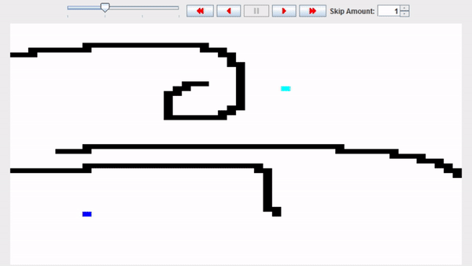

# Grid Visualisation

Visualisation of the A* search algorithm by reading an image and turning it into a grid with a start and end location, and obstacles and applying the algorithm step by step.

The simulation can be paused, reversed, skipped, slowed down and sped up.
The Blue pixel is the start and the Cyan pixel is the goal.

During the visualisation, green pixels are in the queue of being evaluated, red pixels have been evaluated and magenta pixels are the result of the algorithm and form the shortest path from the start to the goal.

## Usage

Create an an image named "Image.png".

The image will be parsed by the program and needs to follow some rules to allow it to be used:
- Maximum size is 150x150
- One pixel needs to be Blue, this is the start cell.
- One pixel needs to be Cyan, this is the goal cell.
- Obstacles need to be Black, these cells will not be passable.
- Any other colors will be interpreted as passable cells.

The program will try to somewhat approximate the colors based on the distance in color space, so they don't need to be equal to the exact RGB values.

Place the image next to the Jar file and execute the program.

Start the algorithm by pressing the "play" button and speed it up/slow it down by adjusting the interval slider.